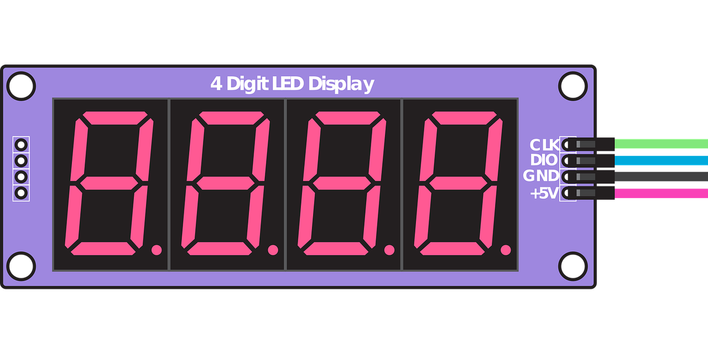

# Number to LCD

  
"[4 Digit 7 Segment Display](https://pixabay.com/fr/illustrations/tm1637-4-chiffres-7-segment-4517661/)" by [kritsadaj](https://pixabay.com/fr/users/kritsadaj-1432068/) is licenced under [Pixabay License](https://pixabay.com/fr/service/license/)

## Description

__Goal:__
Write a program that displays LCD style numbers.

This kata is organized in 2 consecutive parts.

### Description for Part 1

Available [here](InstructionsPart1.md)

__Note:__

* We will stick to digits '0', '1', and '2' because adding more numbers
  is repetitive work that does not provide additional learning.
* Please do NOT read the second part before completing the first.
  Part of the purpose of this kata is to make you practice refactoring
  and adapting to changing requirements.

### Description for Part 2

Available [here](InstructionsPart2.md)

## Getting Started

- [Java](java/GETTING_STARTED.md)
- [C++](cpp/GETTING_STARTED.md)
- [Go](go/GETTING_STARTED.md)
- [Python](python/GETTING_STARTED.md)

## Session Quick Retrospective

You can fill it from [here](QuickRetrospective.md)

## Useful Links

### For this Kata

This kata is based on "Number to LCD" kata available on [codingdojo.org](http://codingdojo.org/kata/NumberToLCD/).

We slightly adjusted requirements in part 2 in order to make it more feasible in a 2-hour session. Besides we believe this change also makes it more interesting in terms of refactoring.

### General

- [TCR (Test && Commit || Revert) wrapper](tcr/TCR.md) utility
- Collaborative timer for pairing or mobbing:
  [mobti.me](https://mobti.me/)
  or [agility timer](https://agility.jahed.dev/)

## Session Information

### Style & Duration

- 2-hour [Randori Kata](doc/RandoriKata.md)

### Topic

- Top-down TDD

### Focus Points

- YAGNI
- Switch to smaller tests for sub problems
- Intentional programming
- Teamwork

### Source Files

- [Java](java)
- [C++](cpp)
- [Go](go)
- [Python](python)

## License

`Kata-NumberToLcd` and the accompanying materials are made available
under the terms of the [MIT License](LICENSE.md) which accompanies this
distribution, and is available at the [Open Source site](https://opensource.org/licenses/MIT)

## Acknowledgements

See [ACKNOWLEDGEMENTS.md](ACKNOWLEDGEMENTS.md) for more information.

## Contributors

<table>
<tr>
    <td align="center" style="word-wrap: break-word; width: 150.0; height: 150.0">
        <a href=https://github.com/mengdaming>
            
             
            <b>Damien Menanteau</b>
        </a>
    </td>
    <td align="center" style="word-wrap: break-word; width: 150.0; height: 150.0">
        <a href=https://github.com/aatwi>
            
             
            <b>Ahmad Atwi</b>
        </a>
    </td>
    <td align="center" style="word-wrap: break-word; width: 150.0; height: 150.0">
        <a href=https://github.com/philou>
            
             
            <b>Philippe Bourgau</b>
        </a>
    </td>
    <td align="center" style="word-wrap: break-word; width: 150.0; height: 150.0">
        <a href=https://github.com/AntoineMx>
            
             
            <b>AntoineMx</b>
        </a>
    </td>
</tr>
</table>
